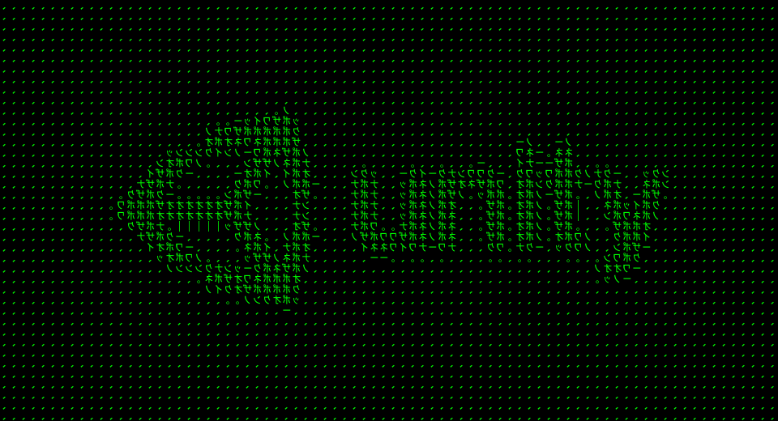

[](https://hub.docker.com/r/naortedgi/workshop/) 
[](https://hub.docker.com/r/naortedgi/workshop/) 
[](https://hub.docker.com/r/naortedgi/workshop/) 
 
 





# Hands on Kube Workshop


# Prerequisite

* Please make sure you have access to this link with github auth [Argo CD](https://argocd-apps.infra-lb.platform-dev-01.us-east-1.ironsrc.mobi/) (if you have any issues ask Devops for help)
* [Install Kubectl CLI](https://kubernetes.io/docs/tasks/tools/install-kubectl-macos/#install-kubectl-binary-with-curl-on-macos)
* Make sure you have access to this repository (https://github.com/ironsource-mobile/apps-helm-charts-platform)


## Were going to cover all following :

* Understand Argo->GitOPS->Helm circle
* Update Charts Tags
* Create Health Check 
* Create Livness Check
* Create a New Pod at the same namespace
* Connect To Other Pods 
* Kubectl inside PODS
* Inject environment Veraibls
* Inject Config map


## Intro:
**Understand Argo->GitOPS->Helm circle** 


**Project File Structure** 

    apps-helm-charts-platform
    ├── ...
    ├── ua-workshop       
    │   ├── Chart.yaml          # a definition of all services under same project 
    │   ├── dev-01.yaml         # environment specific configuration for example (docker image tag,config maps etc...)
    │   └── values.yaml         # environment values , veraible docker image livness probes etc..
    └── ...   
forther reading about devops arcithecture can be find here : [Base-APP](https://github.com/ironsource-mobile/kube-docs/tree/master/guides/base-app)


## Step 0 - Create a new UAT environment with your name 
*  [UAT - Create Workshop Env](https://github.com/ironsource-mobile/platform-js/actions/workflows/create-uat-workshop.yml)
* click `Run workflow`
* At Environment insert `workshop-${your name}` (for exmaple: workshop-naor)
* After job finish you will get 4 urls:
```
{
  "details":"UAT Environment have been created successfully",
  "status":200,
  "apps-helm-chart-branch":"https://github.com/ironsource-mobile/apps-helm-charts-platform/tree/uat-workshop-naor","service-registry-branch":"https://github.com/ironsource-mobile/service-registry/tree/uat-workshop-naor",
  "argocd-apps":"https://argocd-apps.infra-lb.ua-dev.us-east-1.ironsrc.mobi/applications/uat-workshop-naor"
}
200
api url http://ua-workshop.uat-platform.ua-dev.us-east-1.ironsrc.mobi/
```
    * API url - UI for your app  
    * Argo-CD managment for your current env
    * Github branch for `service-registry` repository
    * Github branch for `apps-helm-chart` repository

## Before starting:
* all your changes should be made at you `apps-helm-chart`  branch
`/apps-helm-charts-platform/values/ua/demand-platform/ua-workshop`
* don't push your branch to master 
* after each commit press `Refresh` the environment in argo cd and the UI at the browser

## Step 1 - Change Port to correct one and check UI is working 
 * i accedently map the service PORT to wrong internal port 3324 at `values.yaml`
  our server need to run on port 5400 please update the service internal port 
 * commit and push your chages and update argo 
  if everything works fine you should see a website at your ENV-UI

## Step 2 - Change Image tag to correct one 
 * i accedently create the workshop with the wrong image tag (`not-working`) 
 please update the tag to `latest`
 https://hub.docker.com/repository/docker/naortedgi/workshop/tags?page=1&ordering=last_updated
 * commit and push your chages and update argo 
 * if everything works fine you should see new  website at your ENV-UI

## Step 3 - please add an health check to your workshop POD 
* the pod expose an health check end point `/health`
* use it to configure the health check  at `values.yaml` file
* if you need help check `apps-helm-charts-platform/values/ua/demand-platform/platform-js/values.yaml` for reference 
Note change port and URL according to environment
```
  livenessProbe:
    enabled: true
    failureThreshold: 5
    initialDelaySeconds: 60
    periodSeconds: 5
    successThreshold: 1
    timeoutSeconds: 5
    mode: httpGet
    httpGet:
      port: 3000
      path: /test/version
  readinessProbe:
    enabled: true
    failureThreshold: 5
    initialDelaySeconds: 60
    periodSeconds: 5
    successThreshold: 1
    timeoutSeconds: 5
    mode: httpGet
    httpGet:
      port: 3000
      path: /test/version
```


* make sure your health check pinging more than 5 times 
* if you set it right it will reflect on the ui 

## Step 4 - inject config map 
* please inject a new config map file to the following POD path: `/usr/local/app/config/setup.json` 
the new file needs to be 
    ```json
    {
        "appName": "YOUR_NAME"
    }
    ```
* learn from examples you got plannty here 
`/apps-helm-charts-platform/values/ua/demand-platform/platform-js/dev-01.yaml`
* if you set it right it will reflect on the ui 
```
 volumes:
    config-volume-development:
      mountPath: /usr/local/app/config/setup.json
      subPath: setup.json
      volumeSpec:
        configMap:
          name: ua-workshop-workshop
          items:
            - key: setup.json
              path: setup.json
  configmaps:
    workshop:
      raw_data:
        setup.json: |
          {
            "appName": "Neo"
          }
``` 
## Step 5 - create a new POD from scratch 
follow this guide
https://github.com/ntedgi/kube-argocd-helm-workshop/blob/main/Create-POD.MD 

## Step 6 - inject environment veraible 
open shell into the pod just like `docker exec`
read `SECRET.txt` there you will find the host name for `friend` pod
and instruction on how to add new env veraible to service
the command you need is :

`aws eks update-kubeconfig --region us-east-1 --name platform-dev-01`

`kubectl -n <NAME-SPACE> exec -it <POD> sh`

* you can find your namsepace name by pressing the pod 


## Step 7 - interact with pods on same namespace
* our server need to send request to other POD at the same environment 
* add new environment veraible with the `FRIEND_HOST`
with the uri for the friend host and : `http://.../test/version ` 
* what is the host name of pods under the same namespace?

## License MIT © 

---
```ts
  if (this.repo.isAwesome || this.repo.isHelpful) {
    Star(this.repo);
  }
  if(this.repo.has("BUGS")|| this.repo.has("TYPOS") || this.repo.couldBeBetter){
    OpenPR(this.repo);
  }
```
